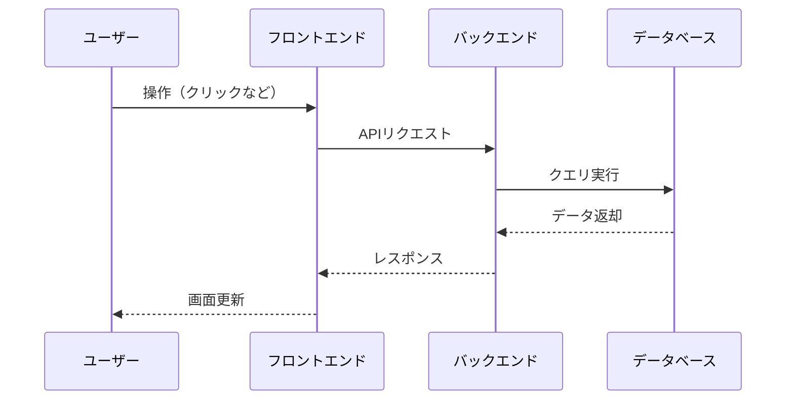

# 【応用】Webアプリの仕組みを理解しよう！（フロントエンド・バックエンド・DB）

Webアプリケーションは、私たちが日常的に使用するサービスの多くを支える重要な技術です。この記事では、Webアプリケーションの基本的な仕組みを、フロントエンド、バックエンド、データベースの3つの観点から解説します。

## Webアプリケーションの全体像

### 基本的な構成要素

Webアプリケーションは、主に以下の3つの要素で構成されています：

1. **フロントエンド**
   - ユーザーが直接操作する部分
   - ブラウザ上で動作するUI
   - HTML、CSS、JavaScriptで構築

2. **バックエンド**
   - サーバー側の処理を担当
   - ビジネスロジックの実装
   - データベースとの連携

3. **データベース**
   - データの永続的な保存
   - 効率的なデータ管理
   - データの整合性保持

### データの流れ

典型的なWebアプリケーションでのデータの流れは以下のようになります：



## フロントエンドの仕組み

### 1. 基本技術

フロントエンドで使用される主な技術：

```html
<!-- HTML: 構造の定義 -->
<!DOCTYPE html>
<html>
<head>
    <title>サンプルアプリ</title>
    <link rel="stylesheet" href="styles.css">
</head>
<body>
    <div id="app">
        <h1>ユーザー一覧</h1>
        <ul id="userList"></ul>
    </div>
    <script src="app.js"></script>
</body>
</html>
```

```css
/* CSS: スタイルの定義 */
.user-card {
    padding: 16px;
    margin: 8px;
    border: 1px solid #ddd;
    border-radius: 4px;
}

.user-name {
    font-weight: bold;
    color: #333;
}
```

```javascript
// JavaScript: 動的な処理
async function fetchUsers() {
    try {
        const response = await fetch('/api/users');
        const users = await response.json();
        
        const userList = document.getElementById('userList');
        users.forEach(user => {
            const li = document.createElement('li');
            li.className = 'user-card';
            li.innerHTML = `
                <span class="user-name">${user.name}</span>
                <p>${user.email}</p>
            `;
            userList.appendChild(li);
        });
    } catch (error) {
        console.error('ユーザー情報の取得に失敗:', error);
    }
}
```

### 2. モダンなフレームワーク

現代のフロントエンド開発では、様々なフレームワークが使用されています：

#### React の例

```jsx
// UserList.jsx
import React, { useState, useEffect } from 'react';

function UserList() {
    const [users, setUsers] = useState([]);
    
    useEffect(() => {
        fetchUsers();
    }, []);
    
    async function fetchUsers() {
        try {
            const response = await fetch('/api/users');
            const data = await response.json();
            setUsers(data);
        } catch (error) {
            console.error('Error:', error);
        }
    }
    
    return (
        <div className="user-list">
            <h1>ユーザー一覧</h1>
            {users.map(user => (
                <div key={user.id} className="user-card">
                    <h2>{user.name}</h2>
                    <p>{user.email}</p>
                </div>
            ))}
        </div>
    );
}
```

#### Vue.js の例

```vue
<!-- UserList.vue -->
<template>
  <div class="user-list">
    <h1>ユーザー一覧</h1>
    <div v-for="user in users" :key="user.id" class="user-card">
      <h2>{{ user.name }}</h2>
      <p>{{ user.email }}</p>
    </div>
  </div>
</template>

<script>
export default {
  data() {
    return {
      users: []
    }
  },
  async created() {
    try {
      const response = await fetch('/api/users');
      this.users = await response.json();
    } catch (error) {
      console.error('Error:', error);
    }
  }
}
</script>
```

## バックエンドの仕組み

### 1. サーバーサイドの基本構造

Node.jsを使用したバックエンドの例：

```javascript
// server.js
const express = require('express');
const app = express();
const port = 3000;

// ミドルウェアの設定
app.use(express.json());

// データベース接続
const { Pool } = require('pg');
const pool = new Pool({
    user: 'postgres',
    host: 'localhost',
    database: 'myapp',
    password: 'password',
    port: 5432,
});

// ルーティング
app.get('/api/users', async (req, res) => {
    try {
        const result = await pool.query('SELECT * FROM users');
        res.json(result.rows);
    } catch (error) {
        console.error('Error:', error);
        res.status(500).json({ error: 'Internal server error' });
    }
});

app.post('/api/users', async (req, res) => {
    const { name, email } = req.body;
    
    try {
        const result = await pool.query(
            'INSERT INTO users (name, email) VALUES ($1, $2) RETURNING *',
            [name, email]
        );
        res.status(201).json(result.rows[0]);
    } catch (error) {
        console.error('Error:', error);
        res.status(500).json({ error: 'Internal server error' });
    }
});

// サーバーの起動
app.listen(port, () => {
    console.log(`Server running at http://localhost:${port}`);
});
```

### 2. APIの設計

RESTful APIの基本的な設計例：

```javascript
// routes/users.js
const express = require('express');
const router = express.Router();

// ユーザー一覧の取得
router.get('/', async (req, res) => {
    try {
        const users = await User.findAll();
        res.json(users);
    } catch (error) {
        res.status(500).json({ error: error.message });
    }
});

// 特定のユーザーの取得
router.get('/:id', async (req, res) => {
    try {
        const user = await User.findById(req.params.id);
        if (!user) {
            return res.status(404).json({ error: 'User not found' });
        }
        res.json(user);
    } catch (error) {
        res.status(500).json({ error: error.message });
    }
});

// 新規ユーザーの作成
router.post('/', async (req, res) => {
    try {
        const user = await User.create(req.body);
        res.status(201).json(user);
    } catch (error) {
        res.status(400).json({ error: error.message });
    }
});

// ユーザー情報の更新
router.put('/:id', async (req, res) => {
    try {
        const user = await User.findById(req.params.id);
        if (!user) {
            return res.status(404).json({ error: 'User not found' });
        }
        await user.update(req.body);
        res.json(user);
    } catch (error) {
        res.status(400).json({ error: error.message });
    }
});

// ユーザーの削除
router.delete('/:id', async (req, res) => {
    try {
        const user = await User.findById(req.params.id);
        if (!user) {
            return res.status(404).json({ error: 'User not found' });
        }
        await user.destroy();
        res.status(204).send();
    } catch (error) {
        res.status(500).json({ error: error.message });
    }
});
```

### 3. ミドルウェア

セキュリティやログ記録などの共通処理：

```javascript
// middleware/auth.js
const jwt = require('jsonwebtoken');

function authenticate(req, res, next) {
    const token = req.headers.authorization?.split(' ')[1];
    
    if (!token) {
        return res.status(401).json({ error: '認証が必要です' });
    }
    
    try {
        const decoded = jwt.verify(token, process.env.JWT_SECRET);
        req.user = decoded;
        next();
    } catch (error) {
        res.status(401).json({ error: '無効なトークンです' });
    }
}

// middleware/logger.js
function logger(req, res, next) {
    console.log(`${new Date().toISOString()} - ${req.method} ${req.url}`);
    next();
}
```

## データベースの仕組み

### 1. リレーショナルデータベース

PostgreSQLを使用した例：

```sql
-- テーブルの作成
CREATE TABLE users (
    id SERIAL PRIMARY KEY,
    name VARCHAR(100) NOT NULL,
    email VARCHAR(255) UNIQUE NOT NULL,
    created_at TIMESTAMP DEFAULT CURRENT_TIMESTAMP
);

CREATE TABLE posts (
    id SERIAL PRIMARY KEY,
    user_id INTEGER REFERENCES users(id),
    title VARCHAR(200) NOT NULL,
    content TEXT,
    created_at TIMESTAMP DEFAULT CURRENT_TIMESTAMP
);

-- データの取得（JOIN操作）
SELECT 
    posts.title,
    posts.content,
    users.name as author_name
FROM posts
JOIN users ON posts.user_id = users.id
WHERE users.id = 1;
```

### 2. ORMの活用

Sequelizeを使用したデータベース操作の例：

```javascript
// models/user.js
const { Model, DataTypes } = require('sequelize');
const sequelize = require('../config/database');

class User extends Model {}

User.init({
    name: {
        type: DataTypes.STRING,
        allowNull: false
    },
    email: {
        type: DataTypes.STRING,
        allowNull: false,
        unique: true,
        validate: {
            isEmail: true
        }
    }
}, {
    sequelize,
    modelName: 'User'
});

// models/post.js
class Post extends Model {}

Post.init({
    title: {
        type: DataTypes.STRING,
        allowNull: false
    },
    content: {
        type: DataTypes.TEXT
    }
}, {
    sequelize,
    modelName: 'Post'
});

// リレーションの定義
User.hasMany(Post);
Post.belongsTo(User);
```

### 3. キャッシュの活用

Redisを使用したキャッシュの例：

```javascript
const Redis = require('ioredis');
const redis = new Redis();

// ユーザー情報のキャッシュ
async function getUserWithCache(userId) {
    // キャッシュの確認
    const cachedUser = await redis.get(`user:${userId}`);
    if (cachedUser) {
        return JSON.parse(cachedUser);
    }
    
    // データベースから取得
    const user = await User.findById(userId);
    if (user) {
        // キャッシュに保存（1時間）
        await redis.set(
            `user:${userId}`,
            JSON.stringify(user),
            'EX',
            3600
        );
    }
    
    return user;
}
```

## セキュリティ対策

### 1. 認証と認可

```javascript
// services/auth.js
const bcrypt = require('bcrypt');
const jwt = require('jsonwebtoken');

class AuthService {
    async login(email, password) {
        const user = await User.findOne({ where: { email } });
        
        if (!user) {
            throw new Error('ユーザーが見つかりません');
        }
        
        const isValid = await bcrypt.compare(password, user.password);
        if (!isValid) {
            throw new Error('パスワードが正しくありません');
        }
        
        const token = jwt.sign(
            { userId: user.id },
            process.env.JWT_SECRET,
            { expiresIn: '24h' }
        );
        
        return { token, user };
    }
    
    async register(userData) {
        const hashedPassword = await bcrypt.hash(userData.password, 10);
        const user = await User.create({
            ...userData,
            password: hashedPassword
        });
        
        return user;
    }
}
```

### 2. 入力バリデーション

```javascript
// middleware/validator.js
const { body, validationResult } = require('express-validator');

const userValidationRules = [
    body('email').isEmail().normalizeEmail(),
    body('password').isLength({ min: 8 }),
    body('name').trim().notEmpty()
];

function validate(req, res, next) {
    const errors = validationResult(req);
    if (!errors.isEmpty()) {
        return res.status(400).json({ errors: errors.array() });
    }
    next();
}
```

### 3. CORS設定

```javascript
// config/cors.js
const cors = require('cors');

const corsOptions = {
    origin: process.env.FRONTEND_URL,
    methods: ['GET', 'POST', 'PUT', 'DELETE'],
    allowedHeaders: ['Content-Type', 'Authorization'],
    credentials: true
};

app.use(cors(corsOptions));
```

## パフォーマンス最適化

### 1. フロントエンドの最適化

```javascript
// webpack.config.js
module.exports = {
    mode: 'production',
    optimization: {
        splitChunks: {
            chunks: 'all',
            minSize: 20000,
            maxSize: 244000,
            cacheGroups: {
                vendor: {
                    test: /[\\/]node_modules[\\/]/,
                    name: 'vendors',
                    chunks: 'all'
                }
            }
        }
    }
};
```

### 2. バックエンドの最適化

```javascript
// services/cache.js
const cache = new Map();

function memoize(fn, ttl = 3600000) {
    return async function (...args) {
        const key = JSON.stringify(args);
        const cached = cache.get(key);
        
        if (cached && cached.timestamp > Date.now() - ttl) {
            return cached.value;
        }
        
        const result = await fn.apply(this, args);
        cache.set(key, {
            value: result,
            timestamp: Date.now()
        });
        
        return result;
    };
}
```

### 3. データベースの最適化

```sql
-- インデックスの作成
CREATE INDEX idx_users_email ON users(email);
CREATE INDEX idx_posts_user_id ON posts(user_id);

-- クエリの最適化
EXPLAIN ANALYZE
SELECT u.name, COUNT(p.id) as post_count
FROM users u
LEFT JOIN posts p ON u.id = p.user_id
GROUP BY u.id, u.name
HAVING COUNT(p.id) > 5;
```

## まとめ

Webアプリケーションの基本的な構成要素について解説しました：

1. **フロントエンド**
   - ユーザーインターフェース
   - モダンなフレームワーク
   - レスポンシブデザイン

2. **バックエンド**
   - APIの設計と実装
   - セキュリティ対策
   - パフォーマンス最適化

3. **データベース**
   - データモデリング
   - クエリの最適化
   - キャッシュ戦略

これらの要素が連携することで、使いやすく安全なWebアプリケーションが実現されます。

## 次のステップ

Webアプリケーションの基本を理解したら、以下の記事も参考にしてください：

- [【入門】データベースとは？SQLの基本を理解しよう](/tech-blog/blog/database-sql-basics/)
- [【初心者向け】APIとは？使い方と実装方法をわかりやすく解説](/tech-blog/blog/api-basics-guide/)
- [【Dockerとは？初心者向けにコンテナ技術をわかりやすく解説】](/tech-blog/blog/docker-basics-guide/)